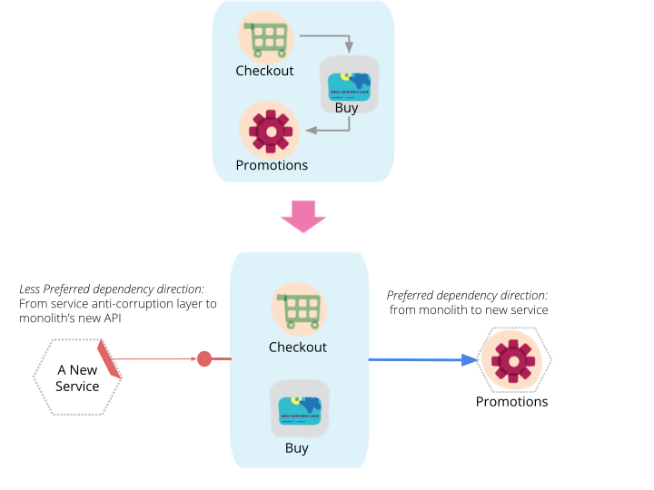

# 如何将一个集成系统分解成微服务

## 解耦什么，何时解耦
*当一个集成系统变得很大难以处理时，很多公司都会被把系统分解成微服务样式所吸引。这是一个值得却不是很容易的开发旅程。我们已经学习到，做好这些，我们需要从一个简单的服务开始，但是之后，提取基于垂直能力的服务，对于经常变化的业务和主题很重要。这些服务开始应该很大，最好不依赖剩下的继承服务。我们应该确保每一步迁移都表示成体架构的原子性改进。*  
将一个集成系统迁移到微服务生态系统是个史诗性的旅程。从事这个旅程的人会有一些愿望，例如提高操作的规模，加速变化的步伐以及远离变化的高代价。他们希望增加团队数量，同时能够使他们并行独立的相互传递数据。他们希望快速的尝试业务的核心功能，并且更快的传递数据。他们还希望避免与更改现有集成系统相关的高成本。  
决定何时如何逐步迁移的能力是将一个集成系统分解成微服务生态的一些架构挑战。在这篇文章中，我分享了一些技术，能够指导交付团队-开发人员，架构师，技术经理-在这个旅程中作出这些分解决策。  
我使用一个多层在线零售应用来阐述这些技术。这个应用能够紧密的结合用户界面，业务逻辑和数据层。我之所以选择这个例子，是因为它的架构具有需要商业运行的集成应用的特点，而且它的技术栈足够现代，能证明的分解比完全重写和替代合理。
## 微服务生态定义
在开始着手之前，每个人对微服务生态系统有个大概了解是很重要的。微服务生态系统是一个服务平台，每个服务都封装了一个业务能力。一个业务能力表示一个业务在特定领域能够满足目标以及职责所做的事情。每个微服务都公开了一个API,开发者可以以自主的方式发现使用它。微服务有独立的生命周期。开发者可以独立的建立，测试以及发布每个微服务。 微服务生态系统强制一个自主长期团队的组织结构，每个天对负责一个或多个服务。与一般认知和微服务中“微”相反，每个服务的大小至关重要，可能会根据组织的运营成熟度有所不同。就像 Martin Fowler说的：微服务只是标志，不是描述。  
  
*图片1:服务封通过自主API装了业务能力，暴露数据和功能*  
## 旅程指导
在深入这个指导之前，了解将一个存在的集成系统分解成微服务有很高的代价，以及需要很多迭代是很重要的。对于开发者和架构师来说，紧密的评估是否将一个存在的集成系统分解是个正确的方法，以及微服务本身是否是正确的目标，是很有必要的。这些弄清楚后，我们可以开始这个指导。
### 通过一个简单以及相当解耦的能力热身
开始一个微服务道路需要一个最小等级的操作准备。它需要按需访问部署环境，构建新的可持续交付的管道，用来独立的构建，测试以及部署可执行服务，以及保护，调试和监视分布式体系结构的能力。无论是构建greenfiled服务还是分解一个现有的系统，都需要业务准备完成。了解更多关于业务准备可以查看Martin Fowler关于微服务先修的文章。好消息是自从Martin的文章后，操作微服务架构的技术已经迅速进化。包括Service Mesh,一个让微服务网络更快，更可靠以及安全的专用基础设施层，容器编排系统，能够提供更高级别的部署架构抽象，以及像GoCD这种作为容器的构建，测试，部署微服务的持续分发系统得发展。  
我建议开发者以及运营团队使用分解或新建的第一个和第二个服务建立底层家畜，持续分发管道以及API管理系统。从与集成系统完全解耦的功能开始，他们不需要更改最近使用的集成系统面向应用的客户端甚至不需要数据存储系统。交付团队为此要优化的是验证他们的交付方法，提高团队的技能，以及建立需要独立部署安全服务的最小基础架构，用来发布自己的API。作为一个例子，对于一个在线零售应用，第一个服务可以是集成系统调用验证终端用户的“终端用户验证服务”，第二个服务可以是客户配置服务，一个能够对新客户端应用提供客户视图的门面服务。  
首先，我建议解耦简单的边界服务。接下来，我们采用不同的方法来深入解耦嵌入在集成系统的功能。我建议先处理边界服务，是因为旅程的开始，交付团建的最大危险是不能正确的运维微服务。所以，最好使用边界服务来练习他们使用的运维先决条件。一旦他们解决了这个，他们可以解决分解集成系统的关键问题。  
  
*图2:使用最小变化的功能热身来开始我们的处理准备*
### 最小化对集成服务的依赖
作为一项基本原则，交付团队需要减少新组建的微服务与集成系统的依赖。微服务的一个优势是有个快速独立的发布周期。对集成系统数据逻辑以及API有依赖，连接服务与集成系统的发布周期，会阻止这个优势。通常，从集成系统远离的最大动力是高成本和缓慢的变化空间，因此，我们希望通过移除对集成系统核心功能的依赖渐进的进行。如果团队遵循本指南，当他们把功能构建到服务的时候，他们会发现，反向的依赖，从集成到微服务。这是一个理想的依赖方向，因为它没有降低对新服务的变化速度。  
考虑一个在线零售系统，“购买“和”促销“是核心功能，在结账过程中，“购买”使用“促销”进程，提供给消费者他们购买货物提供的，有资格的最好促销。如果我们需要决定这两个功能接下来哪个需要先分解，我建议从分解“促销”开始，然后“购买”。因为这个顺序，我们会减少对集成系统的依赖。在这个顺序中“购买”首先保留在集成系统中，依赖外面的新的“促销”微服务。  
下个指导提供了开发者分解服务顺序的其他方法。这意味着他们不可能总是避免对集成服务的依赖。在一个新服务调用集成服务的情况下，我建议从继承服务暴露新接口，并通过新服务的anti-corruption层来确保集成概念不会泄露。努力定义反映良好定义的领域概念以及解构的API,即使集成系统内部实现不一样。在这个不幸的情况下，交付团队会承担更改集成系统，测试发布与集成系统关联的新服务的代价以及困难。  
  
*图3:将不需要依赖集成系统的服务先分解，最小更改集成服务*
### 尽早将棘手的功能分离
我现在假设交付团队在这一点上很乐意构建微服务，并且准备开始处理棘手的问题。然而，他们会发现会被接下来分解的没有依赖集成服务的功能所限制。造成这个的根源是集成系统的一个功能泄漏，没有作为一个领域概念定义，需要集成的功能依赖这个功能。为了能够进行，开发者需要定义棘手的功能，将它解构成定义良好的领域概念，然后将这些领域概念具体华为分离的服务。  
例如一个web应用集成服务，“session”是最耦合的因子之一。在线上零售例子中，会话通常是指很多属性的一个桶，从贯穿不同领域边界例如托运支付配置的用户配置，到例如最近访问页，点击产品，愿望清淡等用户意向以及交互。除非我们解决分解，重构以及解决最近会话的概念，我们将会努力分解为了的许多能力，因为他们将会通过漏洞会话概念与集成系统纠缠在一起。我也不鼓励在集成系统之外建立一个会话服务，因为他会导致在集成系统中存在的尽力的耦合，更糟的是，在进程之外，跨越网络的。  
开发者可以逐步的从棘手的功能中将服务一次一个分解出来。例如先重构“用户愿望清单”，提取出来成为一个新的服务，然后重构用户支付配置成为另一个微服务，然后重复。
  
*图4:确定最耦合的服务，分解重构具体化到具体领域服务*  

Use dependency and structural code analysis tools such as Structure101 to identify the most coupling and constraining factor capabilities in the monolith  
### 垂直分解，尽早分离数据
